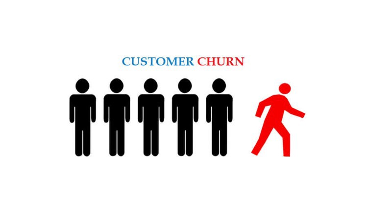

# Data Science Portfolio

---

## Machine learning

### Linear Regression on Bike Sharing Company
A US bike-sharing provider BoomBikes has recently suffered considerable dips in their revenues. They have contracted a consulting company to understand the factors on which the demand for these shared bikes depends. Specifically, they want to understand the factors affecting the demand for these shared bikes in the American market. The company wants to know:

-Which variables are significant in predicting the demand for shared bikes.
-How well those variables describe the bike demands

### Logistic Regression on Telecom Churn
You will be looking at the telecom churn prediction. The variables related to customer behaviour (such as the monthly bill, internet usage etc.) to predict whether a particular customer will switch to another telecom provider or not (i.e. churn or not).

### Lending Club Case study on defaulting
The company wants to understand the driving factors (or driver variables) behind loan default, i.e. the variables which are strong indicators of default. The company can utilise this knowledge for its portfolio and risk assessment.

### Fraud Detection

Fraud detection is a set of processes and analyses that allow businesses to identify and prevent unauthorised financial activity. This may include fraudulent credit card transactions, identity theft, cyber hacking, insurance scams and more.

### EDA

EDA on Maharastra School education

### contact for more details
